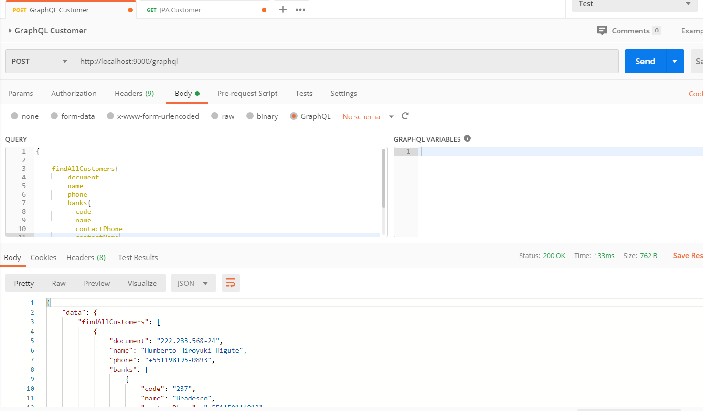

# Spring Boot + JPA (MS SQL Server) + GraphQL

References

https://www.graphql-java-kickstart.com/

https://github.com/graphql-java-kickstart/graphql-spring-boot


Maven dependencies 

```
		<dependency>
			<groupId>com.graphql-java-kickstart</groupId>
			<artifactId>graphql-java-tools</artifactId>
			<version>6.0.2</version>
		</dependency>
		<dependency>
			<groupId>com.graphql-java-kickstart</groupId>
			<artifactId>graphql-spring-boot-starter</artifactId>
			<version>7.0.1</version>
		</dependency>
		<!-- graph"i"ql -->
		<dependency>
			<groupId>com.graphql-java-kickstart</groupId>
			<artifactId>graphiql-spring-boot-starter</artifactId>
			<version>7.0.1</version>
			<scope>runtime</scope>
		</dependency>
		<!-- testing facilities -->
		<dependency>
		    <groupId>com.graphql-java-kickstart</groupId>
		    <artifactId>graphql-spring-boot-starter-test</artifactId>
		    <version>7.0.1</version>
		    <scope>test</scope>
		</dependency>
```


Configure properties *application.properties*

```
# GraphQL
graphql.servlet.mapping=/graphql
graphql.servlet.enabled=true
# GraphiQL
graphiql.mapping=/graphiql-ui
graphiql.endpoint.graphql=/graphql
```


GraphQL Schemas 

* customer.graphqls

```
type Customer {
	document: String!
	name: String!
	phone: String!
	banks: [Bank]
}

type Query {
	findAllCustomers: [Customer]!
	countCustomers: Long!
}

type Mutation {
	createCustomer(document: String!, name: String!, phone: String!): Customer!
}
```


* bank.graphqls

  Notice that types Query and Mutation extended (inherited) from customer.graphqls.

```
type Bank {
	code: String!
	name: String!
	contactName: String!
	contactPhone: String!
}


extend type Query {
	findAllBanks: [Bank]!
	countBanks: Long!
}

extend type Mutation {
	createBank(code: String!, contactName: String!, contactPhone: String!, name: String!): Bank!
	updateBank(code: String!, contactName: String!, contactPhone: String!, name: String!): Bank!
}
```


URLS:


| Description                                                 | URL                                    |
| ----------------------------------------------------------- | -------------------------------------- |
| Service endpoint allowed by @RestController (Only to check) | http://localhost:9000/api/v1/customer/ |
| GraphiQL interface                                          | http://localhost:9000/graphiql-ui      |
| GraphQL endpoint                                            | (POST) http://localhost:9000/graphql   |


Query example


```
{
    
    findAllCustomers{
        document
        name
      	phone
      	banks{
          code
          name
          contactPhone
          contactName
        }
      		
    }
}
```


GraphiQL interface


GraphQL endpoint

